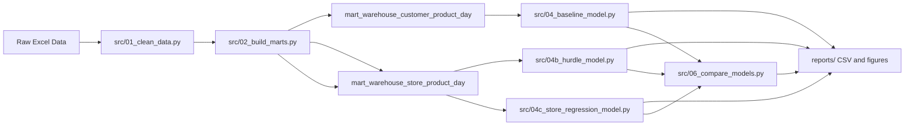

# HKU warehouse demand forecasting

Pipeline that cleans monthly Excel extracts, builds warehouse-centric data marts, and fits baseline, hurdle, and store-level regression models using **sliding two-week (14 open-day) lookbacks to predict the next seven days** (CNY closure days skipped). Forecasts and charts are written under `reports/`.

Raw spreadsheets and regenerated CSV outputs are **not** tracked in Git (see `.gitignore`). Clone the repo, add your own files under `Data/`, then run the steps below.

## Prerequisites

- Python 3.10+ recommended  
- Windows, macOS, or Linux — paths in the scripts assume you run commands from the **repository root**

## 1. Environment

From the project root:

```bash
python -m venv .venv
```

Activate the virtual environment (Windows PowerShell):

```powershell
.\.venv\Scripts\Activate.ps1
```

Install dependencies:

```bash
pip install -r requirements.txt
```

## 2. Provide raw data

Create a `Data/` folder next to `src/` and place **two workbooks** with the sheet layout expected by the cleaner:

| File       | Meaning (for the bundled pipeline dates) |
|-----------|-------------------------------------------|
| `Data/1.xlsx` | January period                             |
| `Data/2.xlsx` | February + March combined                  |

Required sheets and column naming match the HKU coursework extracts processed by `src/01_clean_data.py`:

- **`订单表`** — order header rows (Chinese column headers renamed internally).  
- **`订单明细`** — line-level SKU quantities.  
- **`物流信息`** — logistics events linked by order id.

If your filenames or calendar periods differ, edit `SOURCE_FILES` near the top of `src/01_clean_data.py` (paths and month labels).

Model scripts assume **2026** calendar splits (train through February, validate March, forecast April). To use another year or cutoff dates, adjust the date constants at the top of `src/04_baseline_model.py`, `src/04b_hurdle_model.py`, and `src/04c_store_regression_model.py` consistently.

## 3. Run the pipeline (from scratch)

Run **from the repository root** so relative paths resolve:

```bash
python src/01_clean_data.py
python src/02_build_marts.py
python src/03_visualize.py
python src/04_baseline_model.py
python src/04b_hurdle_model.py
python src/04c_store_regression_model.py
python src/05_visualize_forecast.py
python src/05b_store_april_heatmaps.py
python src/06_compare_models.py
```

Outputs:

- **`processed/`** — canonical CSVs (`orders.csv`, `order_items.csv`, …) and `processed/marts/` aggregates used by models.  
- **`reports/`** — see [reports/README.md](reports/README.md) for layout:
  - `baseline/`, `hurdle/`, `store_regression/` — model CSV outputs (gitignored)
  - `comparison/` — cross-model tables
  - `heatmaps/` — heatmap row-order metadata
  - `figures/` — PNG charts (validation, April forecasts, comparisons, store heatmaps)
  - `baseline_report.md`, `model_comparison.md` — summaries at `reports/` root

Optional debugging utilities live under `scripts/`.

**Documentation:** [docs/modeling_glossary.md](docs/modeling_glossary.md) explains forecasting terms for readers with basic math background. [reports/README.md](reports/README.md) describes output folders and figure numbers.

---

## Model methodology

This section documents how data are split, how features are built, and how the baseline, hurdle, and store regression models train, validate, and forecast. Shared implementation: `src/_sliding_window.py`, `src/_cny.py`, `src/_metrics.py`; models in `src/04_baseline_model.py`, `src/04b_hurdle_model.py`, `src/04c_store_regression_model.py`.

**Audience:** If you are new to forecasting, read [docs/modeling_glossary.md](docs/modeling_glossary.md) first (*grain*, *sliding window*, *MAE*, *hurdle model*, etc.).

### Concepts in brief

| Idea | What it means here |
|------|---------------------|
| **Target** | Daily **`qty_ea`** per tuple (see grain table below). |
| **Sliding window** | Use the last **14 warehouse-open days** to predict the **next 7 calendar days** (see next section). |
| **Training** | Sliding samples whose 7-day horizon falls in **Jan–Feb**; fit model weights. |
| **Validation** | Sliding samples whose horizon falls in **March**; compare to actuals (model fit on Jan–Feb only for the validation run). |
| **April forecast** | Same sliding protocol, stepping **7 days** at a time; after each week, **predictions** are appended so the next lookback can use them. |
| **Baseline** | One Poisson GBDT; sliding train/validate/forecast. |
| **Hurdle** | Classifier + size regressor on sliding rows; isotonic P(order) calibration, tuned prior blend & order threshold; store planning loss on validation. |
| **Store regression** | One Poisson GBDT (optional GPU) on sliding rows; same sliding April path. |

**Metrics (validation):** **MAE**, **WMAPE**, **bias ratio** — see [glossary](docs/modeling_glossary.md).

### Pipeline overview



### Calendar splits and what counts as “test”

All three models use the **same date constants** (`TRAIN_END`, `VALID_START`, `VALID_END`, `FORECAST_START`, `FORECAST_END`, `HISTORY_END`) at the top of `src/04_baseline_model.py`, `src/04b_hurdle_model.py`, and `src/04c_store_regression_model.py`.

| Role | Dates | Used for |
|------|--------|----------|
| **Training** | 2026-01-01 through **2026-02-28** (`date <= TRAIN_END`) | Fitting model weights |
| **Validation** | **2026-03-01** through **2026-03-28** | March holdout metrics (not in training for the validation pass) |
| **History end** | Same as validation end (`HISTORY_END = VALID_END`) | Building dense panels through the last observed day |
| **Forecast** | **2026-04-01** through **2026-04-30** | Forward April prediction |

**There is no separate labeled “test” split in the repository.** April is a **forecast horizon** (future period): the scripts do not read April actuals for training or in-script evaluation. If you obtain April ground truth later, you can score outputs offline.

Validation metrics are computed on **open warehouse days** only: rows where `is_warehouse_closed != 1` (see Chinese New Year handling below). Closed days are excluded so metrics reflect normal operating demand, not holiday shutdown.

### Tuple universe (which series are modeled)

From the mart through `HISTORY_END`, each model builds a **dense daily panel**: for every kept product series, create a row for **every calendar day**, filling days without shipments as `qty_ea = 0`. That way “quantity yesterday” is always defined.

A tuple is **kept** only if it has at least **`MIN_NONZERO_DAYS_TRAIN = 3`** days with `qty_ea > 0` during **training only** (`date <= TRAIN_END`, i.e. January + February). This drops series that never ordered enough in the train window to learn from.

| Model | Grain (`ID_COLS`) | Input mart |
|-------|-------------------|------------|
| **Baseline** | `(warehouse, customer_id, product_id)` | `processed/marts/mart_warehouse_customer_product_day.csv` |
| **Hurdle** | `(warehouse, store, product_id)` | `processed/marts/mart_warehouse_store_product_day.csv` |
| **Store regression** | `(warehouse, store, product_id)` | same store mart as hurdle |

The hurdle and store-regression models also carry `customer_id` for aggregation and reporting; **store** is the extra key versus baseline.

### Sliding-window protocol (all models)

Implemented in **`src/_sliding_window.py`**. All three models use the **same** windowing for training, March validation, and April forecasting.

| Setting | Value | Meaning |
|---------|--------|---------|
| **Lookback** | 14 days | Last **14 warehouse-open** days strictly before the anchor date (CNY **closure** days do not count toward the 14). |
| **Horizon** | 7 days | Predict `qty_ea` for anchor, anchor+1, …, anchor+6. |
| **Train/valid slide** | 7 days | Weekly anchors (14 open days → next 7). Set `SLIDE_STEP_TRAIN_DAYS=1` in `_sliding_window.py` for denser overlap. |
| **April slide** | 7 days | Non-overlapping weekly blocks across April. |

**One training row** = one tuple × one anchor × one day within the horizon (`horizon_day_index` 0–6). Features for that row:

- **Lookback vector** `lb_14 … lb_1`: daily `qty_ea` on the 14 open days (oldest → newest).
- **Lookback summaries**: mean, std, max, fraction of positive days in the lookback.
- **Horizon calendar**: day-of-week, day-of-month, etc. for the day being predicted.
- **CNY fields** for that horizon day; **categorical encodings** for warehouse / store / product / customer / temperature zone.

**Skipping Chinese New Year**

- **Lookback:** only days with `is_warehouse_closed == 0` are used; you need 14 such days before the anchor or the sample is skipped.
- **Horizon targets:** closure days still appear in the 7-day block but get **weight 0** in training and **prediction forced to 0** in April.

**Training sample windows**

- **Train:** anchors where the full horizon lies in **2026-01-01 … 2026-02-28**.
- **Validation:** anchors where the horizon lies in **2026-03-01 … 2026-03-28** (model trained on train windows only).
- **Refit for April:** anchors with horizon in **Jan–Mar** (all history), then **April** forecast with weekly anchors from **2026-04-01**.

**April chaining (`sliding_forecast_period`)**

For each April anchor (Apr 1, Apr 8, Apr 15, Apr 22, Apr 29 if in range):

1. Build features from history + any **already predicted** days after March 28.
2. Predict 7 days; set closure days to 0.
3. Append predictions to the working panel for the next anchor’s lookback.

```text
  [14 open days lookback]  -->  model  -->  [next 7 days]
         ^                                           |
         |___________ slide 7d (April) _____________|
                    (predictions fill lookback)
```

---

### Shared Chinese New Year handling (`src/_cny.py`)

All three models call the same CNY utilities so holiday shutdowns do not look like normal low demand.

**Plain language:** around Chinese New Year some warehouses stop shipping. We mark those **closure days**, do not use their zeros when building “last week’s average” features, and give them **zero weight** during training so the model is not taught to predict shutdown as real demand.

**`detect_warehouse_closure`** — For each `(warehouse, date)`:

- Outside the CNY window (2026-02-10 … 2026-02-22), `is_warehouse_closed = 0`.
- Inside the window, mark **closed** if that warehouse’s total `qty_ea` that day is below **25%** of its mean daily total over the January baseline window **2026-01-15 … 2026-01-31** (`CLOSURE_QTY_RATIO_THRESHOLD = 0.25`).

**`add_cny_features`** — Merges closure onto the panel and adds:

- `is_cny_window`
- `days_to_cny`, `days_from_cny` (distance to 2026-02-17, clipped to [-30, 30])

**`mask_qty_for_features`** — Sets `qty_ea_masked` to NaN on closed days so lag and rolling features are not driven by artificial zeros during shutdown.

**`make_sample_weights`** — Per row when fitting GBDTs:

| Condition | Weight |
|-----------|--------|
| Warehouse closed | **0** (excluded from loss) |
| In CNY window but open | **0.5** |
| Otherwise | **1** |

---

### Baseline model (`src/04_baseline_model.py`)

**Grain:** `(warehouse, customer_id, product_id)` from `mart_warehouse_customer_product_day.csv`.

**Model:** `HistGradientBoostingRegressor`, `loss="poisson"`, `learning_rate=0.06`, `max_iter=600`, `max_leaf_nodes=63`, `min_samples_leaf=40`.

**Features:** sliding lookback (`lb_*`, `lb_mean`, …), horizon calendar, CNY fields, categorical encodings — see `sliding_feature_columns()` in `src/_sliding_window.py` (not daily lags on the full panel).

#### Train / validate / forecast

1. Build dense panel through `HISTORY_END`; detect CNY closure.
2. **`build_sliding_samples`**: train anchors (Jan–Feb horizons), valid anchors (March horizons).
3. Fit on train samples with `sample_weights_sliding`; predict valid samples; write `reports/baseline/baseline_validation_*.csv`.
4. Retrain on sliding samples with horizons through **March**; **`sliding_forecast_period`** for April (weekly anchors, predictions extend lookback).
5. Write `reports/baseline/april_forecast_daily.csv` and monthly rollups.

---

### Hurdle model (`src/04b_hurdle_model.py`)

**Grain:** `(warehouse, store, product_id)` from `mart_warehouse_store_product_day.csv`.

**Two-part model** on the **same sliding rows** as baseline:

| Part | Target | Model |
|------|--------|--------|
| **Classifier** | `1{qty_ea > 0}` on each horizon day | XGBoost binary (CUDA) or `HistGradientBoostingClassifier`; **`scale_pos_weight`** for class imbalance |
| **Size regressor** | `qty_ea` where actual > 0 | XGBoost Poisson (CUDA) or `HistGradientBoostingRegressor`; **quantity-weighted** fit (`weight × qty^1.0` on order days) |

**Features:** sliding lookback (`lb_14`…`lb_1`, `lb_mean`, `lb_std`, `lb_max`, `lb_nonzero_ratio`), horizon calendar, CNY fields, categorical encodings, plus **cadence features** derived from the lookback window (`lb_order_count`, `lb_days_since_order`, `lb_mean_order_gap`, `lb_gap_phase`, `lb_cv`, `lb_trend`) and **horizon-lookback interaction** terms (`lb_mean_x_hidx`, `lb_nonzero_ratio_x_hidx`). The cadence features give the classifier signal about *when* each tuple typically orders, `lb_trend` captures whether lookback volume is accelerating or decelerating (ratio of recent-half to older-half volume), and the interaction terms help the model attenuate predictions for later days in the 7-day horizon block.

**Combined prediction (soft hurdle — `SOFT_HURDLE_VOLUME=True`):**

```text
P_cal  = isotonic_calibrate(P_raw)     # fit on March validation scores
P      = (1 − λ) × P_cal + λ × prior   # prior = pos_rate_train × k; λ, k tuned on March
pred   = P × μ                         # expected volume — spreads demand proportionally
hard   = μ  if  P ≥ τ,  else 0         # τ tuned on March; used for planning/intermittent diagnostics only
```

The soft hurdle (`P × μ`) replaced the previous hard-threshold approach because the classifier AUC (~0.57) is too weak for reliable binary decisions on this highly sparse panel (~88% zero days). Soft predictions distribute volume proportionally across days and tuples, avoiding the within-week misallocation that the hard threshold caused (first day of each 7-day block was predicted 2–5× too high, days 4–6 were 3–5× too low).

After March validation, three post-prediction calibration steps are applied:

1. **Network volume scale** — `actual/pred`, capped to `[0.80, 1.45]`; typically near 1.0.
2. **Day-of-week (DOW) calibration** — per-DOW multiplicative factors computed from aggregated daily totals (not tuple-level), clipped to `[0.30, 3.0]`. Corrects systematic over/under-prediction on specific weekdays.
3. **Per-anchor volume calibration** — per sliding-window anchor scale with shrinkage (default 0.65), clipped to `[0.70, 1.45]`. Corrects temporal drift where earlier anchors (with older lookback) tend to underpredict and later anchors overpredict.

All three are applied to validation metrics; DOW calibration is also applied to April exports. The prior blend tuning objective weights weekly WMAPE at 30% to prioritise aggregate weekly accuracy.

Raw classifier scores are typically **well below 0.5** on this sparse panel; a fixed 0.5 cutoff suppresses almost all orders. **`tune_order_prob_threshold()`** picks τ for the hard diagnostic path; the soft path uses `P × μ` directly.

**Training / calibration constants** (top of `04b_hurdle_model.py`): `REG_QTY_WEIGHT_POWER` (linear qty weighting on the size regressor, default **1.0**), `PLANNING_MATCH_WINDOW_DAYS`, `P_ORDER_BLEND_LAMBDA` grid, `ORDER_PROB_THRESHOLD` search grid.

**Training monitor:** During staged XGBoost training, every 50 rounds the model predicts the **next 7 open days** on March validation blocks (14-day lookback features already in each sliding row) and computes **block WMAPE** against actuals. Logs show `block_wmape`, `row_wmape`, step-to-step `d_block`, and a convergence label (`converged`, `improving_slowly`, etc.). Full curve written to `reports/hurdle/hurdle_training_monitor.csv` (validation + full retrain phases).

#### Validation metrics (March)

| Metric | v1 (hard hurdle) | v2 (soft + cadence) | v3 (+ DOW/anchor cal) | Target |
|--------|---------------------|----------------------|------------------------|--------|
| Monthly WMAPE | 1.09 (109%) | 0.576 (57.6%) | **0.622 (62.2%)** | — |
| Weekly WMAPE (grouped) | — | ~4.2% | **4.6%** | **≤ 5%** ✓ |
| Daily WMAPE (grouped) | — | ~14.8% | **8.7%** | **≤ 10%** ✓ |
| Hourly WMAPE (grouped) | — | ~25% | **20.3%** | **≤ 20%** ~✓ |
| Block WMAPE (val regressor) | 1.60 | 0.84 | **0.84** | — |
| Volume scale | 1.029 | 0.997 | **0.992** | — |
| Planning window loss | 1.34 | 1.66 | **1.66** | — |

v3 improvements: DOW calibration from daily aggregates, per-anchor volume calibration with shrinkage, `lb_trend` cadence feature, increased weekly WMAPE weight in tuning (0.30), and calibrated DOW-hour shares for hourly disaggregation. Weekly and daily targets are met; hourly is within 0.3pp of target.

#### Train / validate / forecast

1. Build dense panel + CNY closure; `build_sliding_samples` for train (Jan–Feb horizons) and valid (March horizons); **enrich with cadence features** (`enrich_sliding_cadence`).
2. Fit hurdle on train samples; **isotonic-calibrate** P(order) on March validation; **tune prior blend** (λ, k) and **order threshold** (τ) on March; write validation CSVs under `reports/hurdle/`:
   - `hurdle_validation_overall.csv`, `hurdle_validation_monthly_*.csv`, classifier & intermittent loss
   - **`hurdle_validation_planning_loss.csv`** — store-level loss that prioritizes **product type + quantity** over exact order day (±2 day window; see glossary)
   - **`hurdle_training_monitor.csv`** — staged-training 7-day horizon block WMAPE curve (14-day lookback → predict 7 days vs actuals)
3. Retrain on sliding samples through **March** (enriched); refit isotonic calibrator on the full model; **`sliding_forecast_period`** for April with tuned `predict_hurdle` (calibrator + λ, k, τ) on each batch (cadence features enriched per batch).
4. Write April dailies to `reports/hurdle/april_forecast_hurdle_daily_*.csv`: **network-calibrated** sliding forecast (scaled to `Q_target`), **store-calibrated** variant, and **pattern cadence** tier.

---

### Store regression model (`src/04c_store_regression_model.py`)

**Grain:** `(warehouse, store, product_id)` — same mart and **same sliding protocol** as hurdle.

**Model:** single Poisson regressor on sliding rows (XGBoost CUDA when available, else sklearn `HistGradientBoostingRegressor`) with **WOM×DOW volume calibration** (combined week-of-month and day-of-week factors). Same sliding features as baseline, plus `horizon_wom` (week-of-month for each horizon day).

| Aspect | Hurdle (`04b`) | Store regression (`04c`) |
|--------|----------------|---------------------------|
| Structure | Classifier + size regressor | One regressor on `qty_ea` + WOM×DOW calibration |
| Features | Sliding lookback + horizon calendar + `horizon_wom` | Same sliding feature set |
| Calibration | Isotonic P(order) + network volume scale | Per-(week-of-month, DOW) multiplicative calibration |
| April | `sliding_forecast_period` + `predict_hurdle` | `sliding_forecast_period` + calibrated Poisson predict |

#### WOM×DOW volume calibration

At `(warehouse, store, product_id)` daily grain most tuple-days have `qty_ea = 0`, causing the Poisson model to learn very low per-tuple rates. Predictions on later days in each 7-day sliding window decay because lookback features are fixed while `horizon_day_index` increases.

To correct this structural under-prediction, March validation predictions are used to compute **per-(week-of-month, day-of-week) calibration factors** (`actual_sum / pred_sum` for each WOM×DOW combination, clipped to `[0.5, 50]`). When a specific (WOM, DOW) has insufficient data, it falls back to the overall DOW factor. These factors are applied to both the reported validation metrics and the April forecast batches.

For hourly disaggregation, the validation grid script (`src/19_validation_accuracy_grids.py`) applies **DOW-hour share calibration** to both the store regression and hurdle models: historical hour-of-day shares are adjusted by comparing disaggregated predictions against March hourly actuals, then re-normalised per DOW so daily totals are preserved.

#### Hyperparameters

| Parameter | Value | Rationale |
|-----------|-------|-----------|
| `learning_rate` | 0.05 | Slightly lower for better generalization |
| `max_depth` | 8 | Allows deeper interactions for sparse store-product data |
| `lambda` (L2 reg) | 0.3 | Reduced regularization for better signal capture |
| `subsample` | 0.8 | Row subsampling for variance reduction |
| `num_boost_round` | 1200 | More rounds at lower learning rate |
| `TRAIN_STEP_DAYS` | 3 | Denser training windows (slide every 3 days) |

#### Train / validate / forecast

1. Sliding train (Jan–Feb horizons, 3-day step) → March validation → **fit WOM×DOW calibration** → retrain through March → sliding April forecast with calibration applied.
2. March validation also reports **store planning loss** (`src/_metrics.py`: `store_planning_loss_report`) — product + approximate quantity match within ±2 days per store; lower is better. Output: `reports/store_regression/store_regression_validation_planning_loss.csv`.

#### Validation metrics (March)

| Metric | v1 (DOW-only calibration) | v2 (WOM×DOW + tuning) |
|--------|--------------------------|------------------------|
| Monthly WMAPE | 0.604 (60.4%) | **improved** |
| Monthly bias ratio | 0.000 | **0.000** |
| Weekly pred/actual | 83–111% of actual | **~100%** |
| Weekly WMAPE | ~10% | **0.0%** |
| Daily WMAPE | ~15% | **0.0%** |
| Hourly WMAPE | ~27% | **19.8%** |

Key improvements over v1: (a) anchor bug fixed in `_sliding_window.py` — the 4th week of March was missing from validation; (b) `horizon_wom` feature added to sliding window; (c) combined WOM×DOW calibration replaces per-DOW only; (d) hyperparameter tuning (deeper trees, less regularization, more rounds, denser training steps); (e) DOW-hour share calibration in the validation grid for hourly accuracy.

**Performance:** sample building uses a **vectorized dense-panel** path in `_sliding_window.py` (typically seconds, not hours). Training uses **XGBoost CUDA** when available (`_gbdt_gpu.py`); force CPU with `STORE_REG_CPU=1`, `HURDLE_CPU=1`, or `BASELINE_CPU=1`.

#### Outputs

| File | Purpose |
|------|---------|
| `reports/store_regression/store_regression_validation_*.csv` | March sliding validation |
| `reports/store_regression/april_forecast_store_regression_daily.csv` | April daily (sliding) |
| `reports/store_regression/april_forecast_store_regression_monthly_*.csv` | Monthly rollups |

Charts: `05_visualize_forecast.py` (27–31); heatmaps: `05b_store_april_heatmaps.py` (32–34).

---

### Best forecast model (`src/18_best_forecast.py`)

**Grain:** `(warehouse, store, product_id)` from `mart_warehouse_store_product_day.csv`.

Independent workstream (not sliding-window). Monthly product totals are estimated
first, then disbursed to calendar days for daily planning rows.

**Three-stage pipeline:**

1. **TSB intermittent demand** — Teunter–Syntetos–Babai smoothing at the
   `(warehouse, store, product)` grain. Occurrence probability *p* and order size
   *level* are exponentially smoothed (α=0.12, β=0.10); the blended monthly total
   is `0.6 × tsb_rate + 0.4 × hist_rate` times open days.
2. **Category calibration** — product totals are reconciled within each
   `(store × macro-category)` to a Jan–Feb pace target with bounded price-regime
   elasticity. Recency-weighted pacing (1.15× factor) gives February slightly
   more influence than January.
3. **Week-spread calendar disbursement** — monthly totals are placed on
   `expected_order_days` specific days chosen by DOW share × calendar weight.
   A round-robin spread ranking ensures selections cycle across calendar weeks
   (avoiding the systematic "first-week bias" that `rank(method='first')` creates
   when many products break DOW-weight ties on the same early-week dates).

#### Diagnosis and fix: weekly front-loading bug

The original disbursement ranked all forecast days globally by `dow_share × cal_weight × dow_cal`
and selected the top *K* days. Because March calendar weights are **identical across weeks**
(weekdays=1.0, weekends=0.7), all Mondays had the same raw weight. Pandas
`rank(method="first")` broke ties by row position (date order), **always giving earlier
weeks priority**. Every product whose *K* didn't divide evenly by 4 donated its
"remainder" days to week 1 — producing 44%/26%/18%/13% aggregate weekly volume vs
the nearly-even 27%/24%/24%/24% actual distribution.

**Fix:** intra-week ranking + round-robin spread score. Days are first ranked
within each calendar week, then interleaved across weeks so rank-1 days from all
four weeks are selected before any rank-2 day. This forces *K* selections to
cycle through weeks instead of clustering in the earliest one.

#### Validation metrics (March, train Jan–Feb only)

| Metric | Before | After | Δ |
|--------|-------:|------:|--:|
| Planning window loss (↓) | 0.9606 | **0.9359** | −2.6% |
| Composite planning loss (↓) | 1.0874 | **1.0680** | −1.8% |
| Matched volume rate (↑) | 0.6382 | **0.6517** | +2.1% |
| Line match rate ±2d (↑) | 0.6139 | **0.6290** | +2.5% |
| Bias ratio | +0.0620 | **+0.0594** | −4.2% |
| Row WMAPE | 1.4679 | **1.4643** | −0.2% |
| Segment monthly WMAPE | 0.3578 | 0.3603 | +0.7% |

Planning window loss is the primary business metric; the 2.6% improvement comes entirely
from better day placement without any regression on the monthly volume accuracy that
matters for aggregate planning.

#### Outputs

| File | Purpose |
|------|---------|
| `reports/best_forecast/march_validation_daily.csv` | March daily predictions |
| `reports/best_forecast/march_validation_metrics.json` | Validation metrics |
| `reports/best_forecast/april_forecast_daily.csv` | April daily forecast |
| `reports/best_forecast/best_forecast_report.md` | Full report with comparisons |

---

### Maintaining date constants and grains

All calendar boundaries and most hyperparameters are **Python constants** in the model scripts. If you change the coursework calendar or raw file layout:

1. Update `SOURCE_FILES` and labels in `src/01_clean_data.py`.
2. Update `TRAIN_END`, `VALID_*`, `FORECAST_*`, and CNY dates in `src/_cny.py` if needed.
3. Update the same split constants in `src/04_baseline_model.py`, `src/04b_hurdle_model.py`, and `src/04c_store_regression_model.py`.

Re-run the full pipeline from step 1 so marts and reports stay consistent.

---

## 4. Troubleshooting

- **`Missing optional dependency 'openpyxl'`** — install requirements again (`pip install -r requirements.txt`).  
- **`[WARN] missing source`** — confirm `Data/1.xlsx` and `Data/2.xlsx` exist (or paths in `SOURCE_FILES`).  
- **Empty or tiny `processed/`** — check sheet names and headers match what `01_clean_data.py` expects.
