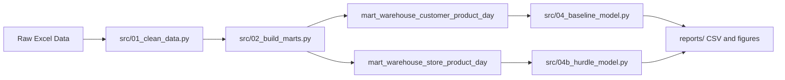

# HKU warehouse demand forecasting

Pipeline that cleans monthly Excel extracts, builds warehouse-centric data marts, fits baseline and hurdle (two-part) GBDT models, and writes forecasts and charts under `reports/`.

Raw spreadsheets and regenerated CSV outputs are **not** tracked in Git (see `.gitignore`). Clone the repo, add your own files under `Data/`, then run the steps below.

## Prerequisites

- Python 3.10+ recommended  
- Windows, macOS, or Linux — paths in the scripts assume you run commands from the **repository root**

## 1. Environment

From the project root:

```bash
python -m venv .venv
```

Activate the virtual environment (Windows PowerShell):

```powershell
.\.venv\Scripts\Activate.ps1
```

Install dependencies:

```bash
pip install -r requirements.txt
```

## 2. Provide raw data

Create a `Data/` folder next to `src/` and place **two workbooks** with the sheet layout expected by the cleaner:

| File       | Meaning (for the bundled pipeline dates) |
|-----------|-------------------------------------------|
| `Data/1.xlsx` | January period                             |
| `Data/2.xlsx` | February + March combined                  |

Required sheets and column naming match the HKU coursework extracts processed by `src/01_clean_data.py`:

- **`订单表`** — order header rows (Chinese column headers renamed internally).  
- **`订单明细`** — line-level SKU quantities.  
- **`物流信息`** — logistics events linked by order id.

If your filenames or calendar periods differ, edit `SOURCE_FILES` near the top of `src/01_clean_data.py` (paths and month labels).

Model scripts assume **2026** calendar splits (train through February, validate March, forecast April). To use another year or cutoff dates, adjust the date constants at the top of `src/04_baseline_model.py` and `src/04b_hurdle_model.py` consistently.

## 3. Run the pipeline (from scratch)

Run **from the repository root** so relative paths resolve:

```bash
python src/01_clean_data.py
python src/02_build_marts.py
python src/03_visualize.py
python src/04_baseline_model.py
python src/04b_hurdle_model.py
python src/05_visualize_forecast.py
python src/05b_store_april_heatmaps.py
python src/06_compare_models.py
```

Outputs:

- **`processed/`** — canonical CSVs (`orders.csv`, `order_items.csv`, …) and `processed/marts/` aggregates used by models.  
- **`reports/`** — Markdown summaries (tracked), CSV metric tables (ignored by Git), and PNG figures under `reports/figures/`.

Optional debugging utilities live under `scripts/`.

---

## Model methodology

This section documents how data are split, how features are built, and how the baseline and hurdle models train, validate, and forecast. Implementation lives in `src/04_baseline_model.py`, `src/04b_hurdle_model.py`, and shared helpers in `src/_cny.py` and `src/_metrics.py`.

### Pipeline overview



### Calendar splits and what counts as “test”

Both models use the **same date constants** (`TRAIN_END`, `VALID_START`, `VALID_END`, `FORECAST_START`, `FORECAST_END`, `HISTORY_END`) defined at the top of `src/04_baseline_model.py` and `src/04b_hurdle_model.py`.

| Role | Dates | Used for |
|------|--------|----------|
| **Training** | 2026-01-01 through **2026-02-28** (`date <= TRAIN_END`) | Fitting model weights |
| **Validation** | **2026-03-01** through **2026-03-28** | March holdout metrics (not in training for the validation pass) |
| **History end** | Same as validation end (`HISTORY_END = VALID_END`) | Building dense panels through the last observed day |
| **Forecast** | **2026-04-01** through **2026-04-30** | Forward April prediction |

**There is no separate labeled “test” split in the repository.** April is a **forecast horizon**: the scripts do not read April actuals for training or in-script evaluation. If you obtain April ground truth later, you can score outputs offline.

Validation metrics are computed on **open warehouse days** only: rows where `is_warehouse_closed != 1` (see Chinese New Year handling below).

### Tuple universe (which series are modeled)

From the mart through `HISTORY_END`, each model builds a **dense daily panel**: every calendar day × every kept tuple, with missing days filled as `qty_ea = 0`.

A tuple is **kept** only if it has at least **`MIN_NONZERO_DAYS_TRAIN = 3`** days with `qty_ea > 0` during **training only** (`date <= TRAIN_END`, i.e. January + February). This filters out tuples that never showed intermittent demand in the train window.

| Model | Grain (`ID_COLS`) | Input mart |
|-------|-------------------|------------|
| **Baseline** | `(warehouse, customer_id, product_id)` | `processed/marts/mart_warehouse_customer_product_day.csv` |
| **Hurdle** | `(warehouse, store, product_id)` | `processed/marts/mart_warehouse_store_product_day.csv` |

The hurdle model also carries `customer_id` for aggregation and reporting; store is the extra key versus baseline.

---

### Shared Chinese New Year handling (`src/_cny.py`)

Both models call the same CNY utilities so closure days do not distort lags or training.

**`detect_warehouse_closure`** — For each `(warehouse, date)`:

- Outside the CNY window (2026-02-10 … 2026-02-22), `is_warehouse_closed = 0`.
- Inside the window, mark **closed** if that warehouse’s total `qty_ea` that day is below **25%** of its mean daily total over the January baseline window **2026-01-15 … 2026-01-31** (`CLOSURE_QTY_RATIO_THRESHOLD = 0.25`).

**`add_cny_features`** — Merges closure onto the panel and adds:

- `is_cny_window`
- `days_to_cny`, `days_from_cny` (distance to 2026-02-17, clipped to [-30, 30])

**`mask_qty_for_features`** — Sets `qty_ea_masked` to NaN on closed days so lag and rolling features are not driven by artificial zeros during shutdown.

**`make_sample_weights`** — Per row when fitting GBDTs:

| Condition | Weight |
|-----------|--------|
| Warehouse closed | **0** (excluded from loss) |
| In CNY window but open | **0.5** |
| Otherwise | **1** |

---

### Baseline model (`src/04_baseline_model.py`)

Single **HistGradientBoostingRegressor** with **`loss="poisson"`** predicting daily `qty_ea` directly (including zeros on the dense panel).

#### Algorithm hyperparameters (`fit_model`)

| Parameter | Value |
|-----------|--------|
| `learning_rate` | 0.06 |
| `max_iter` | 600 |
| `max_leaf_nodes` | 63 |
| `min_samples_leaf` | 40 |
| `l2_regularization` | 0.0 |
| `early_stopping` | False |
| `random_state` | 42 |

#### Features (`feature_columns`)

- **Categorical encodings** (integer): `warehouse`, `customer_id`, `product_id`, `temperature_zone`.
- **Lags** on `qty_ea_masked`: 1, 2, 3, 7, 14, 21, 28 days.
- **Rolling stats** on **shift(1)** masked quantity (windows 7, 14, 28): `rmean`, `rstd`, `rmax`, plus `nonzero_ratio` from actual (unmasked) quantity.
- **Calendar**: day-of-week, day-of-month, month, ISO week, weekend flag.
- **CNY**: `is_cny_window`, `is_warehouse_closed`, `days_to_cny`, `days_from_cny`.

Encoders are fit on the full history panel; categories unseen at scoring map to `-1`.

#### Training and validation flow

1. Load mart → `build_dense_panel` through `HISTORY_END` with tuple filter above.
2. Add CNY features, masked qty, lags, calendar, encodings.
3. **Validation pass**: train on `date <= TRAIN_END` with `make_sample_weights`; predict March open days; write `reports/baseline_validation_*.csv` (daily overall, per warehouse, per customer, monthly tuple totals).
4. **Forecast pass**: **retrain** on **all rows Jan–Mar** (same features and weights).
5. **April**: `recursive_forecast` (see below).

#### March validation metrics

Row-level MAE, RMSE, SMAPE, bias on open March days, plus monthly rollups summing actual vs predicted `qty_ea` per `(warehouse, customer_id, product_id)`.

#### April prediction — recursive multi-step

`recursive_forecast` walks **each day** from `FORECAST_START` to `FORECAST_END`:

1. Append a placeholder row for every tuple on date `d` with `qty_ea = 0`.
2. Concatenate with rolling history (trimmed to enough past days for max lag + max roll window).
3. Recompute features (lags/rolls use **prior predictions** once those days are in rolling history).
4. Predict with the full-history model; clip predictions at 0.
5. Write predicted `qty_ea` into rolling history for the next day.

This is **direct multi-step forecasting via state recursion**: errors can compound across April because each day’s features depend on earlier April predictions.

Outputs include `reports/april_forecast_daily.csv` and monthly aggregates by warehouse, customer×product, and warehouse×customer×product.

---

### Hurdle model (`src/04b_hurdle_model.py`)

A **two-part** model for **intermittent** store-level demand: probability of a positive day × positive quantity size, then optional calibration for April planning totals.

#### Part 1 — Order probability (classifier)

- **Target**: `1{qty_ea > 0}` on every dense-panel row.
- **Model**: `HistGradientBoostingClassifier`, `loss="log_loss"`, `class_weight="balanced"`.
- **Hyperparameters** (`fit_hurdle`): `learning_rate=0.08`, `max_iter=200`, `max_leaf_nodes=48`, `min_samples_leaf=80`.

#### Part 2 — Order size (regressor, positive days only)

- **Target**: `qty_ea` where `qty_ea > 0` (classic hurdle: size model sees only hit days).
- **Model**: `HistGradientBoostingRegressor`, **`loss="poisson"`**.
- **Hyperparameters**: `learning_rate=0.08`, `max_iter=350`, `max_leaf_nodes=48`, `min_samples_leaf=200`.

#### Combined point forecast (`predict_hurdle`)

For each row:

1. `p_raw` = classifier positive-class probability.
2. `mu` = regressor prediction (clipped ≥ 0).
3. **Prior blend** (tuned on March):  
   `p = (1 - λ) * p_raw + λ * p_prior`  
   where `p_prior = clip(pos_rate_train * k, P_ORDER_MIN, pos_rate_train)` and `pos_rate_train` is each tuple’s Jan–Feb fraction of days with `qty_ea > 0` (`tuple_recursive_priors`).
4. **Expected quantity**: `pred = clip(p * mu, 0, ∞)`.

Default constants before tuning: `P_ORDER_BLEND_LAMBDA = 0.10`, `P_ORDER_PRIOR_K = 0.35`, `P_ORDER_MIN = 8e-5`.

**`tuple_recursive_priors`** also computes **`seed_qty`**: mean daily `qty_ea` over the **last 14 days** of history (through `HISTORY_END`), used in cadence-related logic and documented for interpretability.

#### Prior hyperparameter tuning (`tune_prior_hyperparams`)

On **March validation** open days only, grid search over `λ ∈ {0, 0.05, …, 0.25}` and `k ∈ {0.20, …, 0.55}`:

- **Primary**: minimize `|bias_ratio - 1|` on **monthly tuple totals** (sum of daily preds vs sum of actuals per tuple).
- **Secondary**: add `0.04 ×` decision-rule SMAPE where forecast = `pred` if `p_order >= 0.5` else `0`.

Winning `(λ, k)` are stored in validation CSVs and used conceptually for the hurdle story; April production uses the **pattern** path below, not recursive GBDT forecasts.

#### Features (beyond baseline)

Same lag/roll/calendar/CNY block as baseline, plus:

- **Cadence** (`add_cadence_features`): `days_since_last_order`, `mean_gap_28`, `mean_gap_56`, `std_gap_28`, `expected_gap_phase` (closure-aware inter-order gaps).
- **Fourier calendar**: `dow_sin/cos`, `dom_sin/cos`.
- **Lags**: 1–7, 10, 14 (shorter set than baseline).
- **Roll windows**: 7 and 14 only.

Hurdle uses `order_signal` (binary order hit) inside cadence; training rows use actual `qty_ea > 0`.

#### March validation metrics

Reported to `reports/hurdle_validation_*.csv`:

| View | What it measures |
|------|------------------|
| **Dense daily** `p × μ` | Standard MAE/RMSE/SMAPE on all open March rows |
| **Positive actual only** | Quantity error when demand occurred |
| **Decision sparse** | `pred` if `p_order >= 0.5` else `0` |
| **Classifier** | log loss, Brier, ROC-AUC on order-day labels |
| **Intermittent composite** (`intermittent_hurdle_loss_report` in `src/_metrics.py`) | Tuple×month frequency (soft/hard), segment volume WMAPE, MAE on order days |

**SMAPE caveat** (see `src/_metrics.py`): on a dense panel with many zeros, any `y=0` row with `ŷ > 0` contributes SMAPE ≈ 2.0 regardless of how small `ŷ` is. Prefer positive-day metrics or the intermittent composite for intermittent demand.

Network calibration targets from history: **`Q_Jan`**, **`Q_Mar`**, **`Q_target = (Q_Jan + Q_Mar) / 2`** = target mean **network** daily total on the dense panel (`compute_q_targets`).

#### April prediction — what `main()` actually runs

After validation, the script **retrains** `clf_full` and `reg_full` on **Jan–Mar** (full panel, sample weights). **April day-level exports do not call `recursive_forecast`** — that function exists for experimentation but is **not invoked** from `main()`.

Production April path:

**Step A — Pattern construction (`compute_tuple_order_patterns`)**

For each `(warehouse, store, product_id)`:

- **Short window**: last `PATTERN_LOOKBACK_DAYS = 28` days through `HISTORY_END` → short positive-day rate, mean/median qty on hit days, mean inter-order gap, DOW-specific positive rates.
- **Long window**: Jan 1 through `HISTORY_END` → long positive rate and median positive qty.
- **Blend** (`PATTERN_LONG_HISTORY_BLEND = 0.35`):  
  `pos_rate = (1 - w) * pos_rate_short + w * pos_rate_long`  
  Robust size: median/mean mix with shrink toward long-run median (`PATTERN_QTY_MEDIAN_WEIGHT`, `PATTERN_QTY_LONG_SHRINK`).
- **`last_order_date`**: latest day with `qty_ea > 0` in history.

**Step B — Pattern forecast (`pattern_forecast_april`)**

- From `last_order_date`, step forward by `mean_gap_days` (clipped 1–28) to propose **order days** in April.
- Keep a day if its DOW positive rate ≥ `PATTERN_DOW_MIN_FRAC × pos_rate` (default 0.35).
- On scheduled days: `qty_ea = mean_qty_pos`, `p_order = 1`, `mu_qty = mean_qty_pos`; else zeros.
- Force `qty_ea = 0` on warehouse-closed April days.

**Step C — Per-store calibration (`calibrate_april_per_store`)**

For each `(warehouse, customer_id, store)`:

- **Target** = average of that store’s mean **daily total** qty in January and in March (sum across SKUs per day, then mean over days).
- **Scale** April rows so the store’s mean daily April total matches target; clip scale to `[0.15, 3.5]`.

**Step D — Network calibration (`calibrate_april_forecast`)**

- Uniform multiplicative scale on all April `qty_ea` and `mu_qty` so **network** mean daily total matches `Q_target`; clip scale to `[0.5, 3.0]`.

#### Three April daily CSV tiers

| File | Contents |
|------|----------|
| `reports/april_forecast_hurdle_daily_pattern.csv` | After pattern forecast only (Step B) |
| `reports/april_forecast_hurdle_daily_store.csv` | After per-store calibration (Step C) |
| `reports/april_forecast_hurdle_daily.csv` | After network calibration (Step D) — primary scaled forecast |

Monthly rollups and calibration diagnostics: `reports/april_forecast_hurdle_monthly_*.csv`, `reports/hurdle_april_store_calibration.csv`, `reports/hurdle_april_calibration.csv`.

Visualizations in `src/05_visualize_forecast.py` and `src/05b_store_april_heatmaps.py` typically use the **pattern** and **store-calibrated** daily files; compare to baseline via `src/06_compare_models.py`.

---

### Maintaining date constants and grains

All calendar boundaries and most hyperparameters are **Python constants** in the model scripts. If you change the coursework calendar or raw file layout:

1. Update `SOURCE_FILES` and labels in `src/01_clean_data.py`.
2. Update `TRAIN_END`, `VALID_*`, `FORECAST_*`, and CNY dates in `src/_cny.py` if needed.
3. Update the same split constants in **both** `src/04_baseline_model.py` and `src/04b_hurdle_model.py`.

Re-run the full pipeline from step 1 so marts and reports stay consistent.

---

## 4. Troubleshooting

- **`Missing optional dependency 'openpyxl'`** — install requirements again (`pip install -r requirements.txt`).  
- **`[WARN] missing source`** — confirm `Data/1.xlsx` and `Data/2.xlsx` exist (or paths in `SOURCE_FILES`).  
- **Empty or tiny `processed/`** — check sheet names and headers match what `01_clean_data.py` expects.
